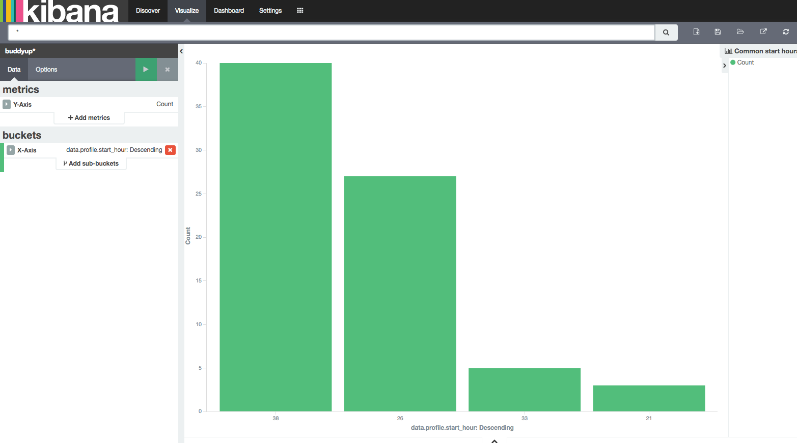

# Elasticsearch dev notes

## Download the latest elasticsearch and kibana from the site

Kibana: `kibana-4.4.2-darwin-x64`  
Elasticsearch: `2.2.1`

Unpack these `tar xzvf elas*.tar.gz` and `tar zxvf kib*.tar.gz` and edit the elasticsearch config file and set a unique cluser name.

## Install a couple plugins

Timelion and marvel (now free for prod and dev) are worthwhile. Kibana provides a GUI, timelion makes time base queries simpler, marvel is Elastic's monitoring interface. It will show cluster stats, node stats, etc.

Install timelion  

    kibana-4.4.2-darwin-x64/bin/kibana plugin -i kibana/timelion

Intall marvel into ES

    elasticsearch-2.2.1/bin/plugin install marvel-agent

Install marvel into Kibana

    kibana-4.4.2-darwin-x64/bin/kibana plugin --install elasticsearch/marvel/latest

If elasticsearch or kibana were running, restart them to see the installs. Preferably elasticsearch first. 

## Configuration

Outside of setting a unique `cluster.name` in the elasticsearch `config/elasticsearch.yml` file, kibana will need to know what index (think database) to look at. I'm prefixing all the indices with "buddyup" so the wild-card selector `buddyup*` will work fine here.

## Getting to know the data

I exported one class's data and imported it to the ES using a simple bulk create from python (see `write_feed` in [explore.py](explore.py). 

Starting to do some quick visualizations from Kibana, I was able to see the most common meeting times for a study group.

