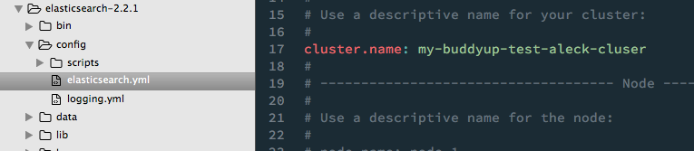
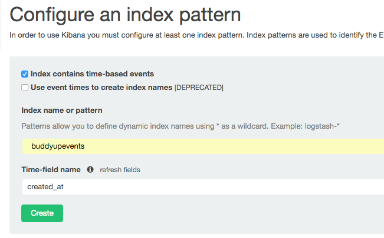
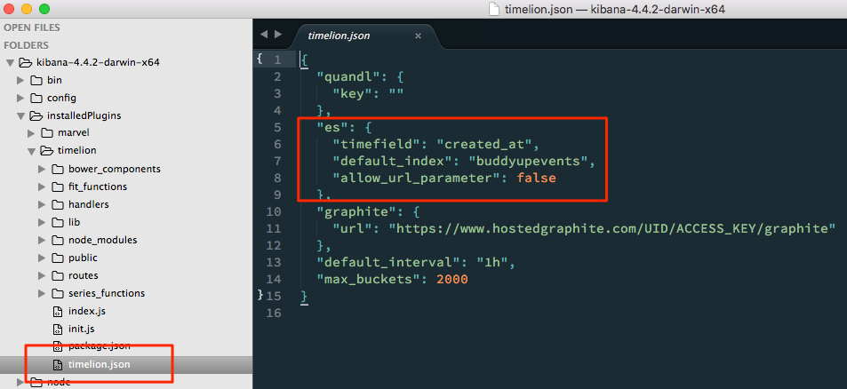
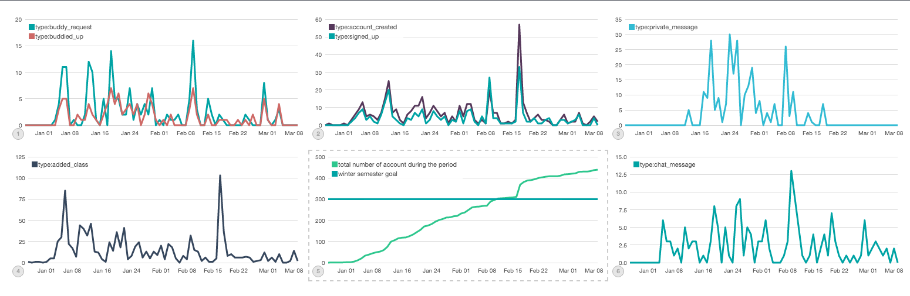
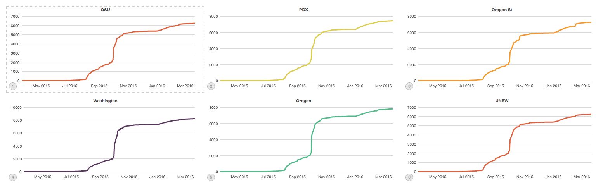

# Elasticsearch dev notes

## Download the latest elasticsearch and kibana from the site

Kibana: `kibana-4.4.2-darwin-x64`  
Elasticsearch: `2.2.1`

Unpack these `tar xzvf elas*.tar.gz` and `tar zxvf kib*.tar.gz` and edit the elasticsearch config file and set a unique cluser name.



## Install a couple plugins

Timelion and marvel (now free for prod and dev) are worthwhile. Kibana provides a GUI, timelion makes time base queries simpler, marvel is Elastic's monitoring interface. It will show cluster stats, node stats, etc.

Install timelion  

    kibana-4.4.2-darwin-x64/bin/kibana plugin -i kibana/timelion

Intall marvel into ES

    elasticsearch-2.2.1/bin/plugin install marvel-agent

Install marvel into Kibana

    kibana-4.4.2-darwin-x64/bin/kibana plugin --install elasticsearch/marvel/latest

If elasticsearch or kibana were running, restart them to see the installs. Preferably elasticsearch first. 


## Configuration

### Configuring elasticsearch 

Outside of setting a unique `cluster.name` in the elasticsearch `config/elasticsearch.yml` file

### Configuring Kibana 

Kibana will need to know what index (think database) to look at. I'm prefixing all the indices with "buddyup" so the wild-card selector `buddyup*` will work fine here. Events will be loaded into the index `buddyupevents` and we can load classes into another index `buddyupclasses`.




### Configuring timelion

For **timelion** to use the event field `created_at` as its time series index, the Kibana plugin config file will need to be updated.

Set the timelion config in `timelion.json` to match

```json
"es": {
  "timefield": "created_at",
  "default_index": "buddyupevents",
  "allow_url_parameter": false
},
```



Now restart kibana.

## Importing event data

With an export of the events, elasticsearch can ingest the data as follows

```python
import explore
explore.create_es('buddyupevents')
explore.write_event_mapping()
data = explore.get_data('buddyup-aleck-events-export.json')
explore.write_feed(data=data, index='buddyupevents')
```

## Visualizing event data

With Kibana, there are a number of options to visualize the data. To get started, we can head over to the `timelion` plugin. http://localhost:5601/app/timelion

First, let's set an appropriate time period by clicking the clock in the top-right corner and set it to `Last 1 year`.  

You'll notice you get a nice line chart, counting all events over time, and you'll see in the search bar `.es(*)` which is shorthand for search the default elasticsearch index (configured in timelion.json) for all documents. 

Let's say we want to see instead of all events, just the buddy requests. I know that to be type `buddy_request` so we can change the search to `.es('type:buddy_request')`, hit enter and we're good to go! Repeat this step and we've got a dashboard. Zoom in to a couple different date ranges to see all the charts update.

Coming to a future near you, build a dashboard in kibana.




Getting signups  

    .es('type:signed_up AND data.school_id: "osu_edu"').title("OSU").label("# signups").color('#dc4153').cusum()
    

