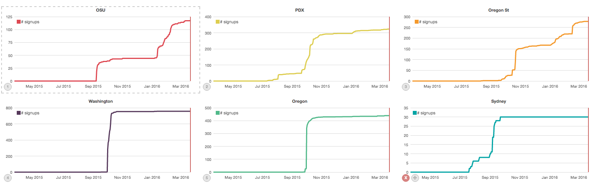

# Elasticsearch dev notes

## Download the latest elasticsearch and kibana from the site

Kibana: `kibana-4.4.2-darwin-x64`  
Elasticsearch: `2.2.1`

Unpack these `tar xzvf elas*.tar.gz` and `tar zxvf kib*.tar.gz` and edit the elasticsearch config file and set a unique cluser name.


## Install a couple plugins

Timelion and marvel (now free for prod and dev) are worthwhile. Kibana provides a GUI, timelion makes time base queries simpler, marvel is Elastic's monitoring interface. It will show cluster stats, node stats, etc.

Install timelion  

    kibana-4.4.2-darwin-x64/bin/kibana plugin -i kibana/timelion

Intall marvel into ES

    elasticsearch-2.2.1/bin/plugin install marvel-agent

Install marvel into Kibana

    kibana-4.4.2-darwin-x64/bin/kibana plugin --install elasticsearch/marvel/latest

If elasticsearch or kibana were running, restart them to see the installs. Preferably elasticsearch first. 

### Python install

```py
pip install -r requirements.txt
python -m textblob.download_corpora
```

## Configuration

### Configuring elasticsearch 

Outside of setting a unique `cluster.name` in the elasticsearch `config/elasticsearch.yml` file

### Configuring Kibana 

Kibana will need to know what index (think database) to look at. I'm prefixing all the indices with "buddyup" so the wild-card selector `buddyup*` will work fine here. Events will be loaded into the index `buddyupevents` and we can load classes into another index `buddyupclasses`.


### Configuring timelion

For **timelion** to use the event field `created_at` as its time series index, the Kibana plugin config file will need to be updated.

Set the timelion config in `timelion.json` to match

```json
"es": {
  "timefield": "created_at",
  "default_index": "buddyupevents",
  "allow_url_parameter": false
},
```


Now restart kibana.

## Importing event data

### Getting an export of events

Since the event data is too large to download from a web browser (77MB) it should be retrieved via the REST API using the auth credentials. *Note for data over 256MB you'll need to concat Firebase support for the data.*


```py
import os
import json
import requests

endpoint = os.environ.get('FIREBASE_ENDPOINT')
key = os.environ.get('FIREBASE_KEY')
url = "{0}/events/.json?print=pretty&auth={1}".format(endpoint, key) 

resp = requests.get(url)
data = resp.json()
with file('events.json', 'w') as f:
    json.dump(data, f)
```

### Importing the data into elasticsearch

With an export of the events, elasticsearch can ingest the data as follows

```python
import explore
explore.create('buddyupevents')
explore.write_event_mapping()
data = explore.get_data('buddyup-aleck-events-export.json')
explore.bulk_load_events(data)
```

## Visualizing event data

With Kibana, there are a number of options to visualize the data. To get started, we can head over to the `timelion` plugin. http://localhost:5601/app/timelion

First, let's set an appropriate time period by clicking the clock in the top-right corner and set it to `Last 1 year`.  

You'll notice you get a nice line chart, counting all events over time, and you'll see in the search bar `.es(*)` which is shorthand for search the default elasticsearch index (configured in timelion.json) for all documents. 

Let's say we want to see instead of all events, just the buddy requests. I know that to be type `buddy_request` so we can change the search to `.es('type:buddy_request')`, hit enter and we're good to go! Repeat this step and we've got a dashboard. Zoom in to a couple different date ranges to see all the charts update.

Coming to a future near you, build a dashboard in kibana.


Getting signups  

    .es('type:signed_up AND data.school_id: "osu_edu"').title("OSU").label("# signups").color('#dc4153').cusum()



## Some stats as reference points

| stat | value | 
| ---- | ----- |
| all events to date as a JSON file | 73MB |
| index size in elasticsearch | 104MB |
| indexing speed | 4,500 docs / sec |
| time to index | <1min
| number of events | 168k
| AVG round-trip query time from js | 140ms |
| Query time in ES | ~50ms |


## Elasticsearch use case

We'll want to use analytics for dashboard and ground control and text search of profiles by school and by class, potentially with auto-suggest.  These should be two separate indicies and potentially clusters since you cannot have a join in ES anyhow.

We'll want to use elasticsearch as an analytics engine to drive visualizations which show the success of the app and the success of the students using the app. We'll want this to assist and drive sales, and provide dashboard and ground control to new levels of insight into our users' interaction with BuddyUP. If we want students to buddyup, the more information we know on how they get there, the better we can design the app to drive them there.

### Stretch Goals

I think after seeing the data visualized over time, particularly private chat, buddy requests and buddy accepts, we'll want to see if relationships exist among interactions. For example "Do users send private chats after buddying up?" or "How many profiles does an average user look at before buddying up?"

Take a look at the chart below.


Are users buddying up just to private chat? What other actions lead to buddying up?

What's an average student's life-cycle?  
What are the events that lead to a successful experience?  
Do we want more stickiness?  
Are we able to quantify success?  (three to five connections?)  
Can we plot the number of users that make the third buddy over time?  (how many users have 3-5 buddies?)

Our most active user over time


#### Heatmap


#### Sentiment Analysis

Notes: [https://realpython.com/blog/python/twitter-sentiment-python-docker-elasticsearch-kibana/](https://realpython.com/blog/python/twitter-sentiment-python-docker-elasticsearch-kibana/)

## Technical implementation

How to integrate with the buddy up app.

In general, this will be a two-step approach. One, load from a dump using the Firebase id as the elasticsearch id and _id. Having both ids be the same is critical for syncing and updating. Two, update the events processing where applicable to update the ES cluster(s) for profile and events. This can be very asynch and as long as the serialization between loading the dump and syncing in the app is the same, we'll be just fine.

To be expected, elasticsearch will fail from time to time, normally this is from malformed queries and timeouts. For analytics this isn't a big deal since it's a drop in the bucket, for profile data, we'll want the sync to retry and yell if it fails.

For full text search of user profiles, I suggest creating a small cluster with an index for the profiles and syncing them on updates. We can then expose an endpoint through `api.buddyup.org` which searches by the search and filters by school and/or class.

For analytics, we'll want a small to medium sized cluster, and once we've explored what easy and possible with elasticsearch we can write the queries into API to either update Firebase periodically (i.e. a caching layer) which dashboard and ground control can consume, or expose new api endpoint on `api.buddyup.org` for the analytics. 

We also have the option of exposing elasticsearch and kibana to white-listed ip-addresses for ad hoc querying and visualizations or writing some flexible front-end to back-end code to allow generic charting and querying of data without exposing elasticsearch to the public, which we don't want to do as there are bot-net exploits in the wild.

#### Milestones (maybe move these into github issues & milestones)

- [ ] find a docker image for elasticsearch
- [ ] create and use aliases to indicies
- [ ] for event index, use index by date or month, e.g. `buddyupevents-2016-01`, `buddyupevents-2016-02`, ..., because in ES searching across indicies is totally OK and recommended. Then we can move old indicies to slower nodes in the future. 
- [ ] decide on elasticsearch version
- [ ] integrate with dewey
- [ ] define elasticsearch goals for app and dashboard/ground control
- [ ] pick a hosting provider
- [ ] capacity plan for upcoming year, luckily ES grows horizontally
- [ ] determine base cluster reqs (normally three master (micro) nodes and two data)
- [ ] review code needed to sync
- [ ] find out a way to get user via API without photo (should be able to get this from events `account_created`, `signed_up`, and `update_profile`)
- [ ] sentiment analysis of `chat_message`, real-time insights into trends in classrooms. Should be fairly simple to do using `data.body` and some python: [http://text-processing.com/demo/sentiment/](http://text-processing.com/demo/sentiment/)
- [ ] github-like d3 calendar [heatmap](https://github.com/DKirwan/calendar-heatmap) of a student, class, and colleges/universities
- [ ] save date time parts for easy querying later: hour, minute, AM/PM, weekday, day of month, day of year, month, year see [https://github.com/alecklandgraf/gardenio/blob/master/sensor_log.py](https://github.com/alecklandgraf/gardenio/blob/master/sensor_log.py)

#### Asks from John

- Would like to get numbers on user drop-off in the onboarding process. Percentage of users who downloaded the app, created a profile, but failed to add a class.
- Would like to know stats for something like: "35% of users access BuddyUp daily, 32% access more than once a week. Another 16% a few times a month."
Then we can start to track usage between those cohorts. Trying things that move folks from a couple times a week to everyday.

### Hosted solutions

Everyone I know hosts themselves, but *Found* would be my recommendation. I haven't used any of the ES providers offered on Heroku, like Bonzai, but we can try them. It's fairly strait forward to backup and restore.


### Known issues

Keeping two databases in sync is a pain. Know that going in.


